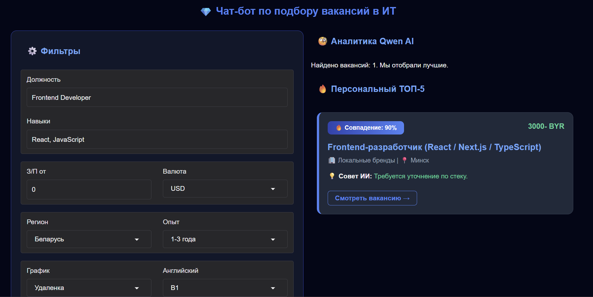
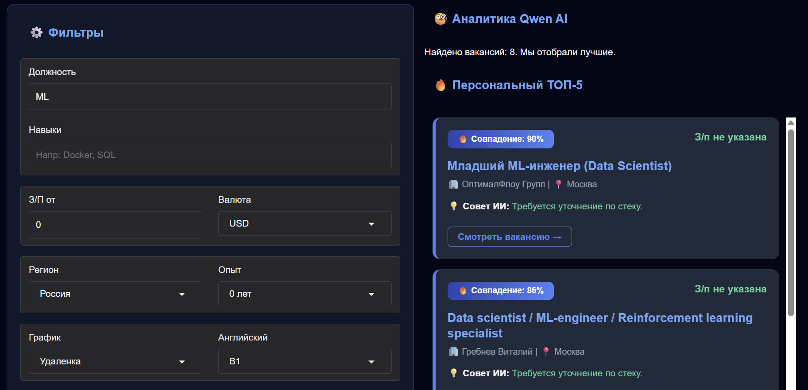
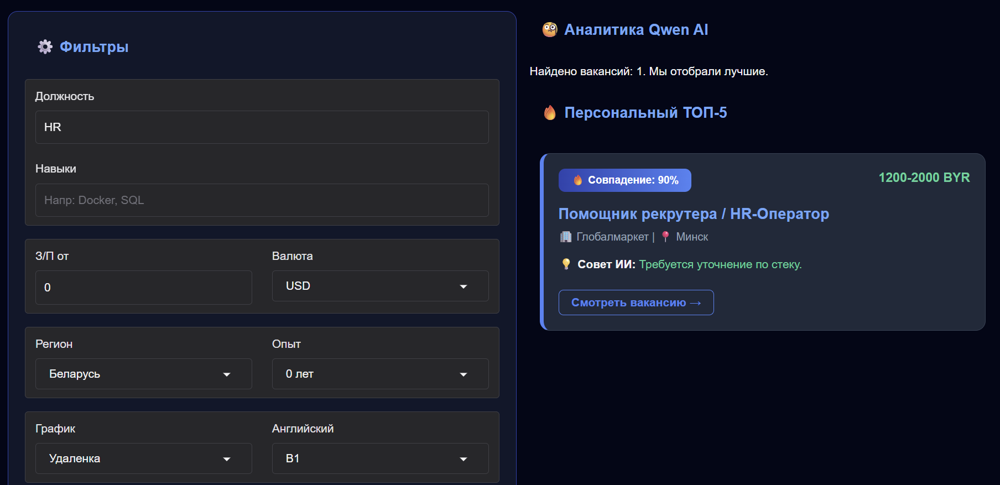

# 💎 AI IT Job Matcher — Умный поиск вакансий

Этот проект помогает находить IT-вакансии на HeadHunter и анализирует их с помощью нейросети Qwen (через OpenRouter).

## ✨ Что умеет бот:
- Ищет вакансии по названию, навыкам и региону.
- Сравнивает ваш стек с требованиями работодателя.
- Выставляет процент совпадения и дает советы от ИИ.
  
## 📸 Интерфейс программы
Вот так выглядит рабочее приложение:

## 📊 Результаты поиска
Примеры анализа вакансий нейросетью:

